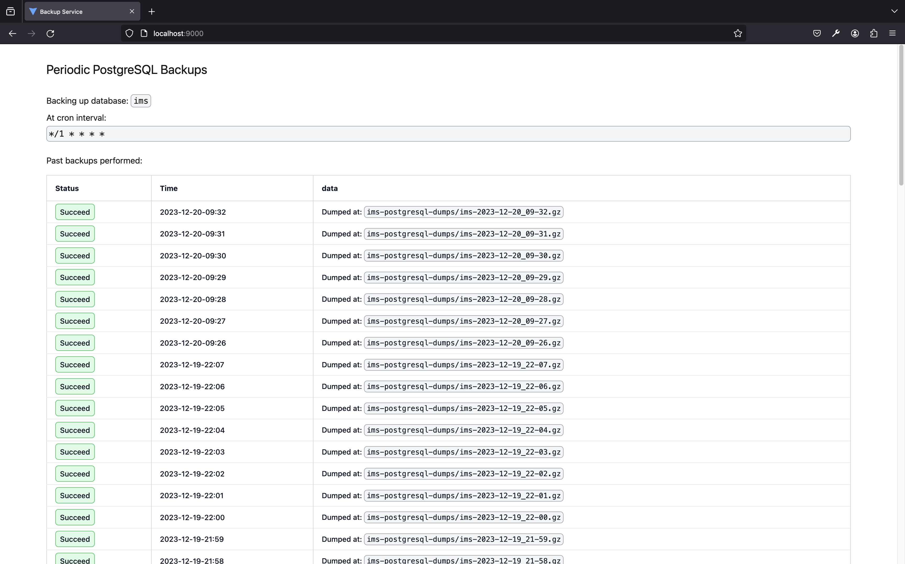
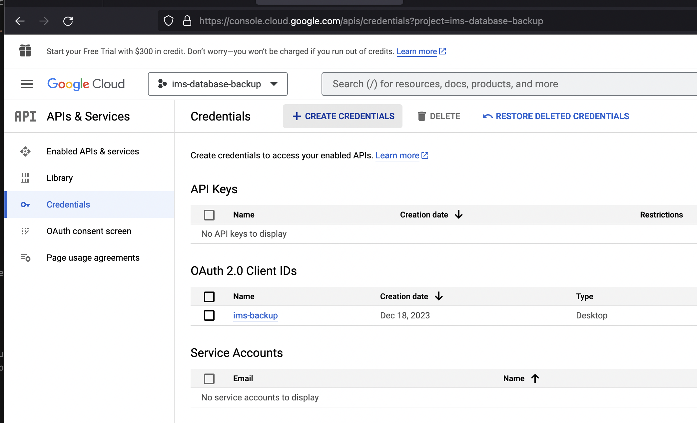
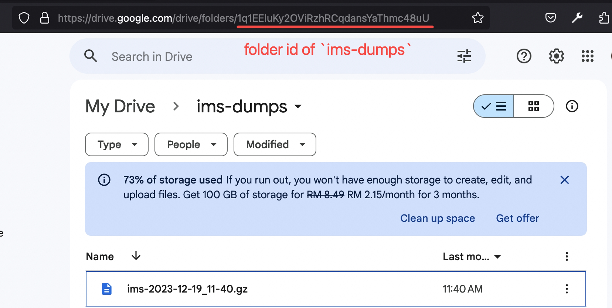

# Database Backup Service

This is a cron service that periodically dumps PostgreSQL database, gzips it and uploads to the Google Drive.

A web interface is also available to view the status of each backup so that failure can be quickly and conveniently spotted.

This service is suitable to be used for automatic backup of self-hosted PostgreSQL database.

## User-interface

## Configuration

There are 3 configurations that needs to be done.

**Configuration 1: `token.json` (`packages/cron/config/google-drive/token.json`).**

The Google Drive tokens. This need to be obtained by running the script locally in `packages/cron`. It cannot be obtained from SSH at the server, because it needs access to the browser.

To obtain this, you need to run the script with the config `packages/cron/google-drive/credentials.json`. `credentials.json` is downloaded from Google Cloud Console

**Configuration 2. `config.json` (`packages/cron/config/config.json`). The general config for the cron.**

There are 3 settings:

1.  `postgresql.database`: Name of the database to backup
2.  `cron.backup_interval`: The interval to perform the backup based on https://crontab.guru/
3.  `google_drive.folder_id`: The id of the folder on Google Drive to store the dump file

    - This can be obtained as follows:

      

4.  `config.ts` (`packages/shared/config.ts`). The config shared between the log viewer and the cron server.

    - There are only one setting `CONFIG.API_SERVER_PORT`. The port the cron server will be running at. This port is also used by `log-viewer` to reference the server in the API URL.

5.  `ecosystem.config.js` (`packages/cron/ecosystem.config.js`). Configure based on `ecosystem.config.example.js`.

    - This is the PM2 config file.

## Deployment

1. Git fetch the repo from the server.
2. Specify the configuration.
3. Build the front-end. From the directory `packages/log-viewer`, run command `pnpm run build`. The build will be outputted at `packages/log-viewer/dist/`. Serve this directory statically from NGINX.
4. Build the back-end. From the directory `packages/cron`, Run command `pnpm run build`, then try running it with `pnpm run start`. If it runs, run it with PM2 using `pm2 start ecosystem.config.js` command at the `packages/cron` directory.

## Resources

- [StackOverflow - tsc doesn't compile alias paths](https://stackoverflow.com/questions/59179787/tsc-doesnt-compile-alias-paths)
